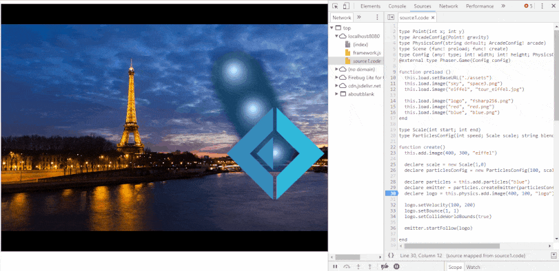
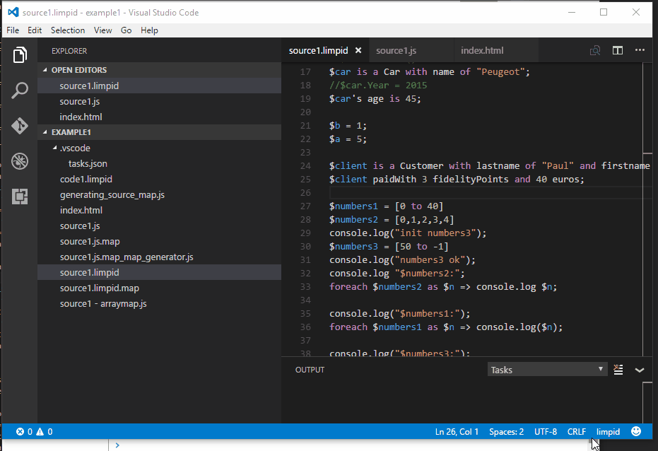
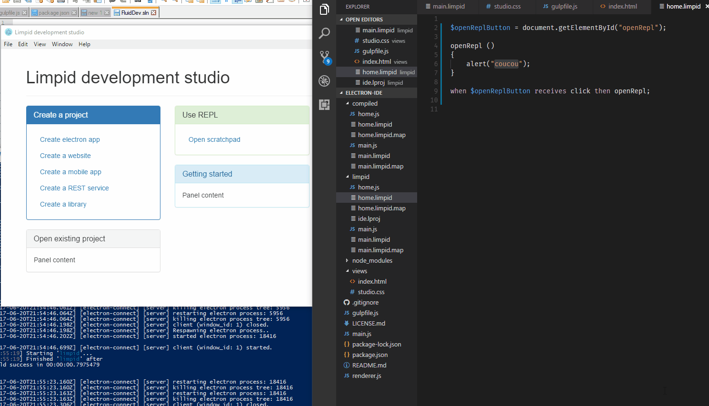
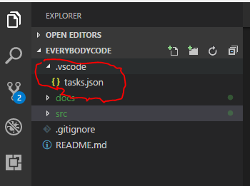
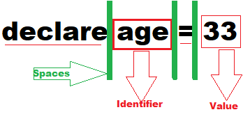
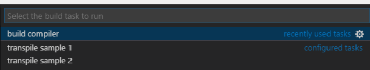
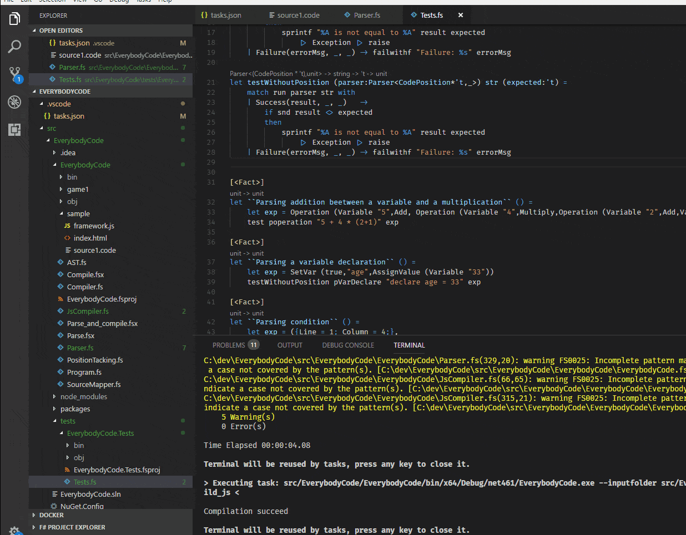
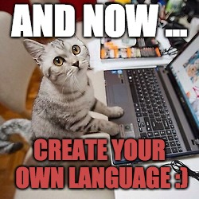

# Coding DOJO

Create your own programming language transpiled to JS with FParsec

---

## Introduction

---

The goal will be to create your own little programming language and to implement the parser.

---

The transpilation code will be provided and will allow you to debug your language in Chrome.

---

It is obviously impossible to finish the exercise in one evening, but fun is guaranteed.

---

You will need FSharp programming tools:

- [Fsharp](http://fsharp.org)

- [VSCode](https://code.visualstudio.com)

- [Ionide](http://ionide.io)

---

### Further informations

---

- Dojo inspired by [Phillip Trelford](http://trelford.com/blog/post/parser.aspx)

- [Understanding Parser Combinators](https://fsharpforfunandprofit.com/posts/understanding-parser-combinators/)

---

## Final objectives

---

Create a small HTML page and debug your code in a browser.



---

You can also create a VS code plugin for your language.



---

Or an [Electron app](https://electronjs.org/)



---

## Getting started

---

Open VS code in the root directory.

You should see `.vscode/tasks.json` in the top of the explorer.



---

### Project structure

---

`samples` folder contains some examples of possible final results.

---

Source code of the transplier is in `src/EverybodyCode/EverybodyCode`.

---

You can find 3 `.fsx`:

- `Compile.fsx`: You can use it to understand how AST is compiled to JS.

- `Parse.fsx`: You must use it to test your parsers while your are creating them.

- `Parse_and_compile.fsx`: Contains minimum of need code to transpile your code. You will need to change some directories. (Not really necessary for the DOJO)

---

And also `.fs` files:

- `PositionTacking.fs`: Contains parsing position utils

- `AST.fs`: Contains [Abstract syntax tree](https://en.wikipedia.org/wiki/Abstract_syntax_tree) of your language.

---

- `JsCompiler.fs`: Contains JS tranpiler.

- `SourceMapper.fs`: JS sources maps generator (used by JS debuggers)

- `Parser.fs`: __You parsing implementation !__

`src/EverybodyCode/tests/EverybodyCode.Tests` contains tests of the transpiler.
(That's why it is in `src/EverybodyCode`).

---

### Write a first parser

---

#### Clone and build the project

---

Clone the repo.

---

Navigate to `src/EverybodyCode` and run:

- `npm i` : Because I use [source-map](https://www.npmjs.com/package/source-map)

- `dotnet restore`

- `dotnet build`

---

#### Simple first parser

---

As you can see, `Parser.fs` is not empty.

I put small parsers like litterals, identifier, variables names, mathematics expressions, etc ...

---

You will need to implement forwarded to ref parsers like:

- `pstatement`: parsing of statements. (conditions, loop, functions declarations, classes, etc ...)

- `pCallExp`: parsing of function or methods calls.

- `expOrOpe`: parsing operation or expression.

- `pApply`: parsing of function call on an expression value.

---

`pstatementimpl` will receive your implementation of `pstatement`.

This is the most important parser.

---

It should be something like:

```F#
pstatementimpl :=
    attempt pVarDeclare <|>
    attempt pFor <|>
    attempt pIf
    // ...
```

---

At first, write most simple parsers like `pVarDeclare`.

If we want to parse `declare age = 33`.

.

We want to match `declare[   ](extracted name "age")[  ]=[ ](extracted value 33)`

---

Open Parse.fsx and eval following parser:

```F#
let pVarDeclare = 
    pstring "declare" >>. ws >>. pidentifier .>> ws .>> pchar '=' .>> ws .>>. pexpr

test pVarDeclare "declare age = 33"
```

Result should be:

```F#
Success: ("age", Litteral (Decimal 33.0))
```

---

##### Basics of FParsec

---

- Operator `>>.`: combine 2 parsers and keep result of the left.

- Operator `.>>`: combine 2 parsers and keep result of the right.

- Operator `.>>.`: combine 2 parsers and keep both results in a tuple.

- Operator `|>>`: send a parser result in a function.

---

So we can build our AST like:

```F#
let pVarDeclare =
    pstring "declare" >>. ws >>. (position .>>. pidentifier) .>> ws .>> pstring "=" .>> ws .>>. pexpr
    |>> fun ((p,name),e) -> p,SetVar (true, name, AssignValue e)
```

Should give:

```F#
Success: ({Line = 1;
  Column = 9;}, SetVar (true,"age",AssignValue (Litteral (Decimal 33.0))))
```

---

`position` is a parser returning position of the result return by the combined parser.
In this project, putting positions in the AST was the most simple solution I found.

---

## You are ready to play

---

Now, the game is to implement your parsing in `Parser.fs` and be able to launch debugging of your own language.

---

If you are in VS code, use `ctrl+maj+b` and choose `build compiler`.



---

Then you can edit `.vscode/tasks.json` to add your transpilation tasks.



---



